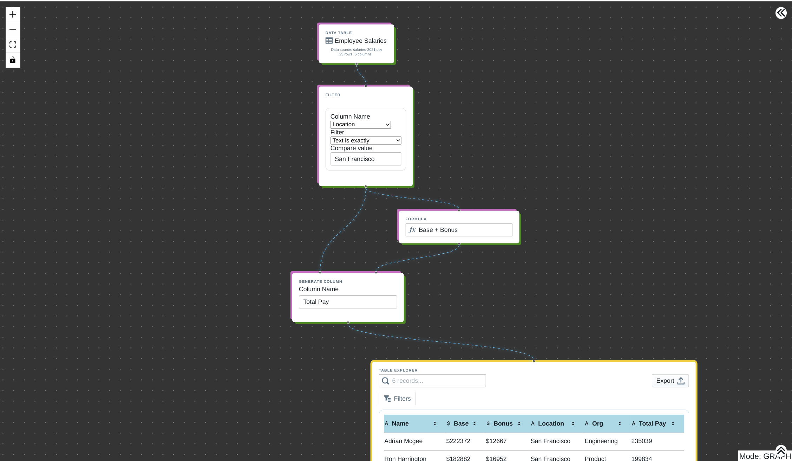

# Github Readme

Current Status: **DRAFT**

# Overview

Aspen is a no-code data analysis platform designed to be as easy and familiar as Excel and as powerful as a Python/Jupyter notebook.

## Standout Features

- 🔒 Completely client-side (no data stored on servers)
- 🤝 Real time collaboration with live cursors
- 📨 End-to-end encrypted sharing (via WebRTC)
- ⚡ Fast, reactive evaluation
- 💡 Easy spreadsheet-like editing of tables
- ⏱️ Full history (with undo/redo) for changes to workspaces and data tables
- ✈️ Offline support
- 🗃️ Import existing data as CSV, TSV, Excel (.xls and xlsx), or from clipboard

## How Aspen works

## Demo

# FAQ

## Is Flower right for me?

If you find yourself frequently using Vlookup, Xlookup, Index, Match, etc in Excel, Flower can make joining tables much easier.

If you are considering writing a script in Python, Node, Bash, etc to transform some data that will be reused by others on your team then Flower can make it much easier for your non-programming colleagues to use and understand your program.

If you want to quickly and collaboratively explore a set of data to answer questions like "What is the average salary in our London office?" or "Who from our survey indicated they used MacOS _and_ used Microsoft Edge", then Flower is probably the fastest and easiest way to figure that out.

## How does Flower compare to Excel, SQL, etc?

Coming soon...

# Roadmap

- Data visualization
- Hosted data including data sets and workspaces
- Expandable standard library (externally published nodes)
- Compound nodes
- Version snapshotting
- External datasource connections
  - Firebase, Postgres, Shopify, etc
- Working with large datasets

# Contribution Guide

We're thrilled to have external contributors so don't hesitate to create an Issue or open a Pull Request. We don't have formal guidelines just yet but we plan to formalize a process after the first few contributions.

### Bug Fixes

We don't follow a strict versioned release process and release frequently. So if you discover a bug, make a PR or file an issue and it will be live on our domain within a few minutes of merging into Main.

### Submitting new Node Types

We plan to support hundreds if not thousands of types of Nodes; however, our currently architecture would not handle that well. Don't let that discourage you if you have an idea for a Node — we just might not be able to include right away until we iron out our dynamic node inclusion system.

Please see [Node Classes](https://www.notion.so/Node-Classes-bc9b490f0601488dae0fa5a377f0802d) for more information.

[Node Classes](https://www.notion.so/Node-Classes-bc9b490f0601488dae0fa5a377f0802d)
